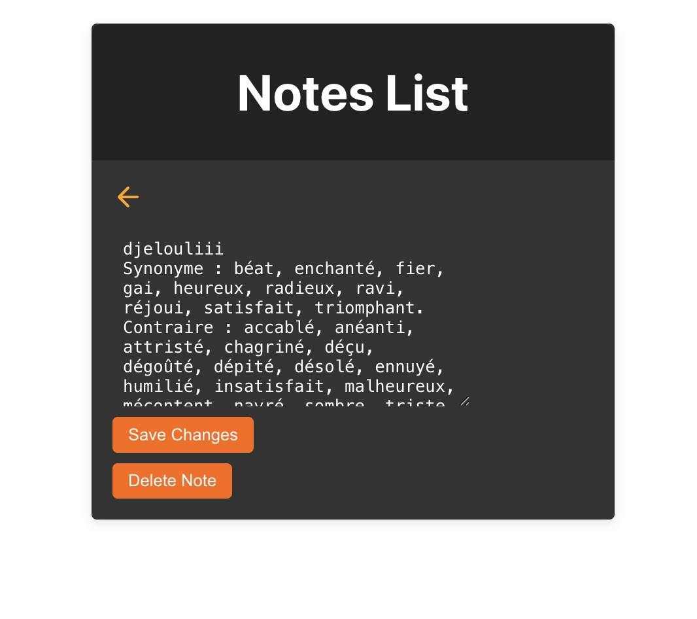

# 📝 Django React Notes App
A web application for managing notes, built with Django REST Framework backend and React frontend. This project demonstrates CRUD (Create, Read, Update, Delete) operations in a modern web development stack.

## 🚀 Features
### Backend (Django REST Framework)

- CRUD Operations:

  * ✅ Create new notes

  * 📖 Read and list all notes

  * ✏️ Update existing notes

  * 🗑️ Delete notes

- SQLite Database for data persistence

- CORS Configuration for frontend-backend communication

### Frontend (React)
- Modern React Hooks (useState, useEffect)

- Responsive Design with CSS styling

- User-Friendly Interface with intuitive controls

## 🎨 Screenshots

Notes Dashboard: Clean interface showing all notes 

Add Note Form: Modal or inline form for new notes

## 🛠️ Tech Stack
- Backend:

  * Python 3.13.2

  * Django 5.2.7

  * Django REST Framework

  * SQLite3

- Frontend:

  * React 18+

  * CSS3 for styling

  * HTML5

## 📝 Learning Outcomes : 

- Full-stack development with Django and React

- REST API design and implementation

- Frontend-backend integration

- CRUD operations in a web application

- Modern JavaScript and Python development practices
